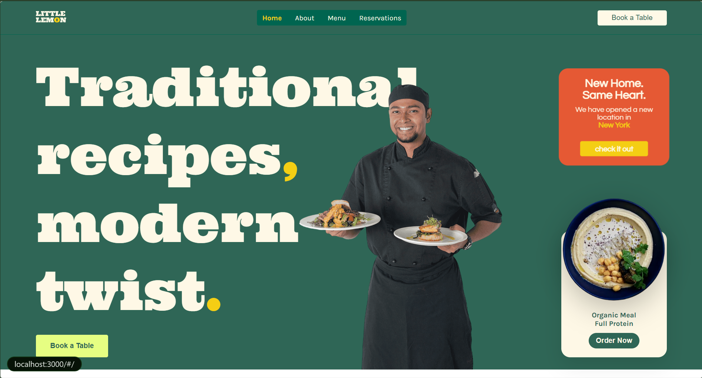

# Little Lemon Restaurant 🍋

A frontend project built as part of the **Meta Front-End Developer Certificate**. Built with **React**.

> **Important disclaimer before you read the commit history and get confused:**
> Yes, this UI looks nothing like the course's Little Lemon design. No, it's not a mistake.
> Little Lemon opened a new location in New York — they levelled up, got a Michelin star (probably),
> and the old brand wasn't going to cut it anymore. An executive decision was made. The rebrand
> happened. You're welcome, Little Lemon.

---

## Live Preview

[molokochris.github.io/little-lemon-restaurant](https://molokochris.github.io/little-lemon-restaurant/)

---

## Screenshots

### Homepage


---

## About the Project

This started as a standard course project following the Meta Front-End Developer curriculum.
Somewhere around commit `5ac1e85` ("still not sure about this new UI"), doubt crept in. By
commit `229bd71` ("new images, new hero, new header and button and css"), the rebrand was in
full swing.

The course had guidelines. The guidelines were noted. A different direction was chosen.

The new design features:
- A bold serif hero with oversized type
- A deep forest green palette with cream, orange, and yellow accents
- Floating cards for the new location announcement and menu highlights
- A pulsating "New Location" card (because subtlety is overrated)
- A chef photo layered behind the headline text

This is a **living project** — the UI will keep improving as the skills behind it do.

---

## Tech Stack

- React
- CSS3
- JavaScript (ES6+)

---

## Getting Started

```bash
# Clone the repo
git clone https://github.com/molokochris/little-lemon-restaurant.git

# Install dependencies
npm install

# Run locally
npm start

# Build for production
npm run build
```

---

## Deployment

This project is deployed via GitHub Pages from the `ui-update` branch.
The `main` branch holds the original course build — a simpler, guideline-compliant version
that served its purpose and was retired with respect (mostly).

To deploy the latest build:

```bash
npm run build
npx gh-pages -d build -b gh-pages
```

---

## Commit Highlights

| Date | What happened |
|------|--------------|
| Apr 9 | Initial build submitted |
| Apr 10 | New images, new hero, full CSS rework begins |
| Apr 11 | Lemon logo added, pulsating location card, card alignment fixes, cleanup |

*(Some commits are labelled "..." and "other changes I forgot about" — the code knows what it did.)*

---

## Branch

Active development is on `ui-update`. The `main` branch holds the original submitted build.

---

## Author

**Moloko Chris Poopedi** — [molokochris](https://github.com/molokochris)

Meta Front-End Developer Certificate
